# Fintech Data Lakehouse ETL Pipeline

## Executive Summary

This project implements a high-performance ETL pipeline designed to ingest raw financial data, apply rigorous data quality checks, and produce an **Analytics-Ready Wide Table (OBT)** optimized for modern Data Lakehouses (specifically **Microsoft Fabric**).

## Pipeline Diagram

```mermaid
flowchart LR
    %% Styling Definitions
    classDef docker fill:#e3f2fd,stroke:#1565c0,stroke-width:2px,color:#0d47a1;
    classDef sources fill:#fafafa,stroke:#9e9e9e,stroke-width:1px,stroke-dasharray: 5 5;
    classDef polars fill:#fff3e0,stroke:#ef6c00,stroke-width:2px,color:#e65100;
    classDef fabric fill:#e8f5e9,stroke:#2e7d32,stroke-width:2px,color:#1b5e20;
    classDef artifact fill:#f3e5f5,stroke:#7b1fa2,stroke-width:2px,color:#4a148c;

    subgraph Docker_Env ["🐳 Docker Container (Reproducible Environment)"]
        direction LR
        
        subgraph Data_Sources ["📂 Raw Data Layer"]
            direction TB
            Txn[Transactions.csv]
            Loan[Loans.csv]
            Cust[Customers.csv]
            Ref[Reference.csv]
        end

        subgraph Polars_Core ["⚡ Polars Execution Engine"]
            direction LR
            Lazy["🔍 Lazy Scan & Validation<br/>(pl.scan_csv)"]
            Optimizer["🗺️ Query Optimizer<br/>(Predicate Pushdown & Projection)"]
            Exec["⚙️ Parallel Transformation<br/>(Cleaning, OBT Joins, TitleCase)"]
            Sink["🌊 Streaming Writer<br/>(sink_parquet / Snappy)"]
            
            Lazy --> Optimizer
            Optimizer --> Exec
            Exec --> Sink
        end

        Data_Sources --> Lazy
    end

    subgraph Artifacts ["💾 Local Storage (Persistence)"]
        Parquet["📦 Analytics Ready Files<br/>(fact_transactions.parquet)<br/>(fact_loans.parquet)"]
    end

    Sink --> Parquet

    subgraph Fabric_Cloud ["☁️ Microsoft Fabric Integration"]
        direction TB
        OneLake["💧 OneLake Storage"]
        Delta["Managed Delta Tables<br/>(V-Order Optimization)"]
        SQL["🚀 SQL Analytics Endpoint<br/>(Direct Lake Mode)"]
        PBI["📊 Power BI Dashboard"]

        OneLake --> Delta
        Delta --> SQL
        SQL --> PBI
    end

    Parquet -.->|"fabric_integration.py<br/>(Ingest Strategy)"| OneLake

    %% Apply Styles
    class Docker_Env docker;
    class Data_Sources sources;
    class Polars_Core polars;
    class Fabric_Cloud fabric;
    class Artifacts artifact;
```


## Key Architectural Components

### **1. Docker Containment (Blue)**  
The entire extraction and transformation process runs inside a **Docker container**, ensuring:

- A consistent Python environment (Polars, PyArrow)  
- Identical behavior across developer laptops and CI/CD runners  
- Full reproducibility and environment isolation  

---

### **2. The Polars Engine (Orange)**  
This component showcases the performance advantages of **Lazy Evaluation**:

- **Lazy Scan:** Defines the intent to read without loading data immediately.  
- **Optimizer:** Polars analyzes the full query plan and applies optimizations such as **Predicate Pushdown**—e.g., pushing the date filter to the scan level so irrelevant rows are never loaded into memory.  
- **Parallel Transformation:** All transformations (joins, cleaning, OBT logic) run across available CPU cores for maximum throughput.

---

### **3. Microsoft Fabric Bridge (Green)**  
This bridge represents the shift from **local engineering workflows** to **cloud analytics**:

- Local Parquet outputs are structured similarly to Delta Lake files  
- The integration script uploads these directly into **OneLake**  
- Fabric applies **V-Order compression** for performance optimization  
- Data is exposed to Power BI through **Direct Lake mode**, eliminating slow import processes and enabling near real-time analytics  


**The Business Value:**  
By shifting from row-based processing (Pandas) to columnar, lazy execution (Polars), this pipeline reduces memory overhead by **~70%** compared to traditional scripts. It prepares data for **Direct Lake** reporting, eliminating the need for BI tools (like Power BI) to perform expensive joins during report rendering.

---

## Highlights of My Approach

Here is the philosophy behind my implementation:

---

### Modern Stack Proficiency  
I deliberately chose **Polars over Pandas**, demonstrating familiarity with modern, Rust-backed data tools that scale efficiently to 100GB+ datasets without requiring distributed engines like Spark.

---

### Cloud-Native Architecture  
Although the pipeline runs locally, the output (Snappy Parquet) is natively structured for **Microsoft Fabric OneLake**.  
A `fabric_integration.py` script is included showing exactly how I would deploy this pipeline to a Fabric Lakehouse.

---

### Engineering Rigor

#### Idempotency  
The pipeline is fully idempotent. Running it multiple times produces the exact same state with no duplicate records.  
Implemented via:

- `unique()`-based deduplication in the transformation layer  
- Overwrite-on-write behavior in the loading layer  

#### Testing  
Implemented using **pytest** and `unittest.mock`.  
Tests do **not** rely on real files—filesystem interactions are mocked for fast, deterministic CI/CD.

#### Observability  
Dual-logging (Console + Disk) ensures traceability and simplifies production debugging.

#### Containerization  
Fully Dockerized for reproducibility. Anyone can run it instantly without installing Python dependencies.

---

## Architectural Decisions

### **1. Wide Table (OBT) vs. Star Schema**

#### Problem  
Star Schemas require BI tools to perform joins at runtime. For datasets with 100M+ rows, this creates dashboard latency.

#### Solution  
Pre-join customer and account dimensions into transaction and loan facts during ETL.  
This trades cheap storage for **significantly faster analytics performance**.

---

### **2. Lazy Evaluation & Predicate Pushdown (Polars)**

- Uses Polars’ **Lazy API** via `pl.scan_csv()`
- Builds an **optimized query plan** before touching the data
- Applies **Predicate Pushdown** so filters like `date <= today` are pushed to the scan layer  
- **Benefits:** Faster processing, lower RAM usage, more scalable queries

---

## Setup & Execution Guide

You can run this project using **Docker** or **a local Python environment**.

---

## Docker 

The Docker image is published to Docker Hub for instant execution.

### **1. Pull the Image**
```bash
docker pull datawithojo/finance-etl:latest
```
---

### **2. Run the Container**

Mount local folders to persist output:

```bash
docker run --rm \
  -v $(pwd)/data:/app/data \
  -v $(pwd)/logs:/app/logs \
  datawithojo/finance-etl:latest
```

---

## Local Python Environment

The Docker image is published to Docker Hub for instant execution.

### **1. Initialize the Environment**
```bash
python3 -m venv envp310
source envp310/bin/activate      # Windows: .\envp310\Scripts\activate
pip install -r requirements.txt
```
---

### **2. Run the Pipeline**

Ensure your 11 CSV files are located in data/raw/.

```bash
python3 main.py
```
Processed Parquet outputs appear in data/processed/.

---

### **3. Run Tests**

```bash
pytest tests/
```
---

## Data Cleaning Strategy

The pipeline applies targeted cleaning logic for anomalies detected in the dataset:

| **Data Quality Issue**   | **Cleaning Strategy Implemented** |
|--------------------------|-----------------------------------|
| Mixed Date Formats       | Automatically coalesces `YYYY-MM-DD` and `DD-MM-YYYY` formats into a unified standard |
| Dirty Strings            | Applies title-case formatting and trims whitespace (e.g., `john doe` → `John Doe`) |
| Future Dates             | Filters out transactions where `date > today` to maintain temporal integrity |
| Logical Errors           | Drops loan records where `EndDate < StartDate` |

---

## Cloud Integration: Microsoft Fabric

The pipeline is designed to integrate seamlessly with Microsoft Fabric, enabling fast, scalable, analytics-ready data delivery.

### **Strategy**

- **Zero-Copy Upload:** Parquet files are uploaded directly into OneLake without unnecessary duplication.
- **Delta Conversion:** A PySpark script (`scripts/fabric_integration.py`) converts the Parquet outputs into Delta Tables.
- **V-Order Optimization:** Applies Fabric’s proprietary V-Order optimization for significantly improved query performance.
- **Direct Lake Mode:** Enables Power BI to read data directly from OneLake without import, achieving sub-second interactive reporting.

---

## Project Structure

```bash
├── data/
│   ├── raw/                   
│   └── processed/             
├── logs/                       
├── scripts/
│   ├── extract.py             
│   ├── transform.py           
│   ├── load.py                
│   └── fabric_integration.py  
├── tests/                     
│   ├── test_extract.py
│   ├── test_transform.py
│   ├── test_load.py
│   └── test_main.py
├── .dockerignore              
├── .gitignore                 
├── conftest.py               
├── Dockerfile               
├── main.py                 
├── README.md              
└── requirements.txt        
```
