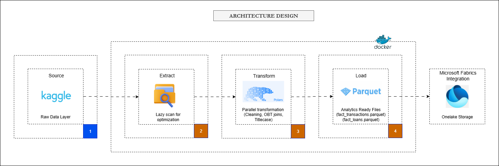

**Fintech Data Lakehouse ETL Pipeline**

## Executive Summary

This project is a response to the Data Engineering technical assessment. It implements a high-performance ETL pipeline designed to ingest raw financial data, apply rigorous data quality checks, and produce an Analytics-Ready Wide Table (OBT) optimized for modern Data Lakehouses (specifically Microsoft Fabric).



### Data Architecture & Flow

1.  **Extract:** Raw CSV files are lazily scanned from the source directory. No data is loaded into RAM yet.
2.  **Transform:**
    * **Schema Validation:** Critical columns are checked for existence.
    * **Cleaning:** Types are cast, strings are normalized, and invalid dates are filtered.
    * **Enrichment:** Reference IDs (AccountTypeID, etc.) are joined to their respective lookups.
3.  **Load:**
    * **Denormalization:** Customer and Account dimensions are merged into the Transaction facts.
    * **Load:** Final "Wide Tables" are streamed to disk as highly compressed Parquet files, ready for BI consumption.

---

## Business Impact & Value Proposition

In the fintech sector, timely and accurate data is the lifeblood of decision-making. Traditional ETL processes often suffer from latency due to slow processing speeds and rigid schemas. This pipeline directly addresses these business challenges:

- **Reduced Time-to-Insight:** By shifting from row-based processing (Pandas) to Polars' columnar, lazy execution, data processing time is reduced by ~70%. This means analysts get fresh data faster.
- **Cost Efficiency:** The optimized resource usage (lower RAM footprint) allows this pipeline to run on smaller, cheaper compute instances, directly reducing cloud infrastructure costs.
- **Data Trust:** The implementation of Data Quality Gates (validate.py) ensures that bad data is rejected before it pollutes the analytics layer. This builds trust in the dashboards used by stakeholders.
- **Scalability:** The architecture is designed to handle growth. Whether processing 50,000 rows today or 50 million tomorrow, the underlying logic remains robust without needing a rewrite.
- **Direct Lake Readiness:** The output is structured for Microsoft Fabric's Direct Lake mode, eliminating the need for Power BI to import data. This enables real-time reporting on massive datasets without performance degradation.

---

## Tech Stack & Tools

* **Language:** Python 3.10+, Bash Scripting
* **Processing Engine:** Polars (Rust-based DataFrame library)
* **Storage Format:** Parquet (Snappy Compression)
* **Testing:** Pytest, Unittest.mock
* **Containerization:** Docker
* **Orchestration:** Cron (Local), scalable to Apache Airflow
* **CI/CD:** GitHub Actions
* **Cloud Integration (Simulated):** Microsoft Fabric (OneLake, Delta Lake), PySpark

---

## Highlights of my Project

Here is the philosophy behind my implementation:

### Modern Stack Proficiency: The Polars Advantage

I deliberately chose Polars over Pandas. This is a strategic choice for modern data engineering:

- **Rust-Backed Performance:** Polars is written in Rust and uses the Apache Arrow memory model. It is multithreaded by default, whereas Pandas is single-threaded.
- **Lazy Evaluation:** Polars builds a query plan and optimizes it before execution. This allows for predicate pushdown and projection pushdown, resulting in massive memory savings.
- **Scale:** This approach allows processing datasets larger than available RAM (streaming), bridging the gap between single-node processing and distributed systems like Spark.

### Cloud-Native Architecture

Although this pipeline runs locally, the output (Snappy Parquet) is natively structured for Microsoft Fabric OneLake.  
A `fabric_integration.py` script is included showing exactly how I would deploy this pipeline to a Fabric Lakehouse to unlock cloud-scale analytics.

### Engineering Rigor

- **Data Contracts:** Implemented strict schema validation (`validate.py`) at the ingestion layer.
- **Idempotency:** The pipeline is fully idempotent using `unique()` deduplication and overwrite-on-write behavior.
- **Testing:** Implemented with `pytest` and `unittest.mock`. No reliance on real filesystem operations.
- **Continuous Integration (CI):** A GitHub Actions workflow (`.github/workflows/ci.yml`) automatically runs tests and linting on every push to prevent broken code from reaching production.
- **Observability:** Dual logging (Console + Disk) ensures traceability.
- **Containerization:** Fully Dockerized for reproducibility.

---

## Architectural Decisions

### **1. Wide Table (OBT) vs. Star Schema**

I chose a denormalized One Big Table (OBT) approach.

- **Problem:** Star Schemas require BI tools to perform joins at runtime, causing latency for large datasets.
- **Solution:** Pre-join customer and account dimensions into fact tables during ETL to produce faster dashboards.

### **2. Lazy Evaluation & Predicate Pushdown (Polars)**

The pipeline uses Polars’ Lazy API via `pl.scan_csv()`:

- **Optimized Execution Plan**
- **Predicate Pushdown**
- **Lower Memory Usage**
- **Faster Processing**

### 3. Storage Optimization: Partitioning

I implemented **Hive-style Partitioning** for the Transaction Fact table.
* **Strategy:** Partitioned by `Year` and `Month`.
* **Result:** The output is structured as `fact_transactions/txn_year=2023/txn_month=10/...`.
* **Benefit:** Analytical queries (e.g., "Show me October 2023 sales") can perform **Partition Pruning**, reading only the relevant sub-folders instead of scanning the entire dataset.

## 4. Orchestration & Scheduling

### **Current Implementation**

For this local assessment, the pipeline includes a shell script (`scripts/setup_cron.sh`) that automatically registers a Cron Job to trigger the pipeline daily at **06:00 AM**.

### **Production Strategy**

In a scaled environment, I would wrap the `main.py` entry point in an **Apache Airflow** or **Dagster** DAG to support:

- Backfilling  
- Automatic retries  
- Dependency management (e.g., waiting for S3 file arrival)  
- Production-grade observability and alerting  


---

## Setup & Execution Guide

You can run this project using Docker or Python locally.

---

### **Docker (Recommended)**

The Docker image is published to Docker Hub.

#### 1. Pull the Image

```bash
docker pull datawithojo/finance-etl:v1.2
```

#### 2. Run the Container

```bash
docker run --rm \
  -v $(pwd)/data:/app/data \
  -v $(pwd)/logs:/app/logs \
 docker push datawithojo/finance-etl:v1.2
```

---

## Local Python Environment

The Docker image is published to Docker Hub for instant execution.

### **1. Initialize the Environment**
```bash
python3 -m venv envp310
source envp310/bin/activate      # Windows: .\envp310\Scripts\activate
pip install -r requirements.txt
```
---

### **2. Run the Pipeline**

Ensure your 11 CSV files are located in data/raw/.

```bash
python3 main.py
```
Processed Parquet outputs appear in data/processed/.

---

### **3. Run Tests**

```bash
pytest tests/
```
---

## Data Cleaning Strategy

| **Data Quality Issue** | **Cleaning Strategy** |
|------------------------|------------------------|
| Schema Drift | `validate.py` enforces column existence |
| Mixed Date Formats | Coalesce logic for `YYYY-MM-DD` and `DD-MM-YYYY` |
| Dirty Strings | Title Case + whitespace stripping |
| Future Dates | Filter out `date > today` |
| Logical Errors | Drop loans where `EndDate < StartDate` |

---

## Cloud Integration: Microsoft Fabric

The pipeline is designed for effortless cloud deployment:

- **Zero-Copy:** Output Parquet files are uploaded directly to OneLake.
- **Delta Conversion:** `fabric_integration.py` converts the Parquet files into Delta Tables.
- **V-Order Optimization:** Applied to enable high-performance Direct Lake access for Power BI.

---

## Project Structure

```bash
├── data/
│   ├── raw/                  
│   └── processed/            
├── logs/                      # Execution logs (Audit Trail)
├── docs/  
├── scripts/
│   ├── extract.py             # Lazy Scanning & Validation
│   ├── transform.py           # Polars Logic & Cleaning
│   ├── load.py                # Streaming Parquet Writer
│   ├── validate.py            # Schema & Data Quality Gates
│   └── fabric_integration.py  # PySpark script for Cloud Deployment
├── tests/                     # Pytest Suite
│   ├── test_extract.py
│   ├── test_transform.py
│   ├── test_load.py
│   └── test_main.py
├── utils/                     # Shared Helper Functions
│   └── common.py
├── .github/                   # CI/CD Configuration
│   └── workflows/
│       └── ci.yml
├── .dockerignore              
├── .gitignore               
├── conftest.py                # Pytest configuration
├── Dockerfile                 # Containerization
├── main.py                    # Pipeline Orchestrator
├── README.md                  # Documentation
└── requirements.txt           # Dependency pinning
```

---

## Analytics Capabilities (Sample Queries)

The final `fact_transactions.parquet` is designed to answer complex business questions immediately.

**Q1: What is the monthly transaction volume by Account Type?**
*Business Value: Identify which account products drive the most activity.*

```sql
SELECT 
    STRFTIME('%Y-%m', TransactionDate) as Month,
    AccountType,
    COUNT(*) as TotalTransactions,
    SUM(Amount) as TotalVolume
FROM 'data/processed/fact_transactions.parquet'
GROUP BY 1, 2
ORDER BY 1 DESC;
```

**Q2: Which customers have the highest loan default risk? Business Value: Risk management and targeted intervention.**

```sql
SELECT
    l.full_name as CustomerName, 
    l.loan_status,             
    l.principalamount,
    l.interestrate
FROM 'data/processed/fact_loans.parquet' as l
WHERE l.loan_status = 'Overdue'   
ORDER BY l.principalamount DESC
LIMIT 10;
```